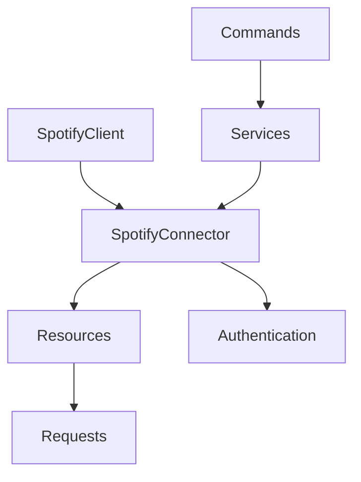

# Architecture Overview

## 🏗️ System Design

The Spotify Client package follows a layered architecture built on modern Laravel and Saloon patterns.

## Core Components



### 1. SpotifyClient (Facade Layer)
```php
SpotifyClient implements SpotifyClientInterface
├── albums(): AlbumsResource
├── artists(): ArtistsResource  
├── tracks(): TracksResource
├── playlists(): PlaylistsResource
└── users(): UsersResource
```

**Purpose**: High-level interface for consumers
**Pattern**: Facade/Proxy pattern

### 2. SpotifyConnector (HTTP Layer)
```php
SpotifyConnector extends Saloon\Http\Connector
├── resolveBaseUrl(): 'https://api.spotify.com/v1'
├── defaultHeaders(): ['Accept' => 'application/json']
├── authentication: TokenAuthenticator
└── traits: AcceptsJson, AlwaysThrowOnErrors
```

**Purpose**: HTTP client configuration and middleware
**Pattern**: Connector pattern (Saloon)

### 3. Resources (Grouping Layer)
```php
BaseResource extends Saloon\Http\BaseResource
├── AlbumsResource
├── ArtistsResource
├── TracksResource
├── PlaylistsResource
└── UsersResource
```

**Purpose**: Group related API endpoints
**Pattern**: Resource pattern

### 4. Requests (Endpoint Layer)
```php
BaseRequest extends Saloon\Http\Request
├── Albums/
│   ├── GetAlbumRequest
│   └── GetAlbumsRequest
├── Artists/
│   ├── GetArtistRequest
│   └── GetArtistsRequest
└── ...
```

**Purpose**: Individual API endpoint implementations
**Pattern**: Request pattern (Saloon)

### 5. Services (Business Logic Layer)
```php
Services/
├── OAuthFlowHandler - OAuth flow management
├── CredentialValidator - API testing and validation
├── EnvironmentDetector - Laravel app analysis
├── CodeGenerator - Example generation
└── SpotifyAppManager - App creation workflow
```

**Purpose**: Complex business logic and workflows
**Pattern**: Service pattern

### 6. Authentication (Auth Layer)
```php
Auth/
├── SpotifyAuthConnector - Token endpoints
├── Requests/
│   ├── ClientCredentialsTokenRequest
│   ├── AuthorizationCodeTokenRequest
│   └── RefreshTokenRequest
└── Contracts/AuthenticatorInterface
```

**Purpose**: Authentication flows and token management
**Pattern**: Strategy pattern

## Design Principles

### 1. Single Responsibility
Each class has one clear purpose:
- **Connectors**: HTTP configuration
- **Resources**: Endpoint grouping  
- **Requests**: Individual endpoints
- **Services**: Business logic

### 2. Dependency Injection
All dependencies are injected via constructor:

```php
public function __construct(
    private readonly SpotifyConnector $connector
) {}
```

### 3. Interface Segregation
Clear contracts for each layer:

```php
interface SpotifyClientInterface
{
    public function albums(): AlbumsResource;
    public function artists(): ArtistsResource;
    // ...
}
```

### 4. Open/Closed Principle
Extensible through inheritance and composition:

```php
// Extend base request for custom endpoints
class CustomSpotifyRequest extends BaseRequest
{
    // Custom implementation
}
```

## Data Flow

### 1. Request Flow
```
Client Code
    ↓
SpotifyClient
    ↓
Resource (albums(), artists(), etc.)
    ↓
Request (GetAlbumRequest, etc.)
    ↓
SpotifyConnector
    ↓
Saloon HTTP Client
    ↓
Spotify API
```

### 2. Authentication Flow
```
OAuth Request
    ↓
OAuthFlowHandler
    ↓
SpotifyAuthConnector
    ↓
Token Request (ClientCredentials/AuthCode)
    ↓
Token Response
    ↓
SpotifyConnector (with TokenAuthenticator)
```

## Error Handling Strategy

### 1. HTTP Errors
- **Saloon's AlwaysThrowOnErrors**: Converts HTTP errors to exceptions
- **RequestException**: Base exception for HTTP failures
- **Custom error mapping**: Service-specific error handling

### 2. Authentication Errors
- **401 Unauthorized**: Token expired or invalid
- **403 Forbidden**: Insufficient scopes
- **400 Bad Request**: Invalid credentials

### 3. Validation Errors
- **CredentialValidator**: Comprehensive API testing
- **Environment validation**: Configuration checks
- **Token validation**: Expiration and scope checking

## Performance Considerations

### 1. Connection Reuse
- Single SpotifyConnector instance per request cycle
- Persistent HTTP connections via Saloon

### 2. Rate Limiting
- Built into Spotify API responses
- Graceful handling of 429 Too Many Requests

### 3. Caching
- Token caching (when implemented)
- Response caching (optional)
- Configuration caching

## Testing Strategy

### 1. Unit Tests
- Individual request classes
- Service logic
- Authentication flows

### 2. Integration Tests
- Full API workflows
- OAuth flows with mock server
- Error handling scenarios

### 3. Mock Testing
- Saloon's mock client for testing
- Predictable responses
- No external API dependencies

---

**Next**: [Saloon Integration](saloon-integration.md)